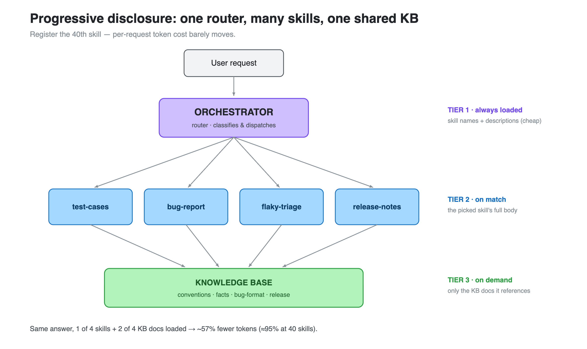
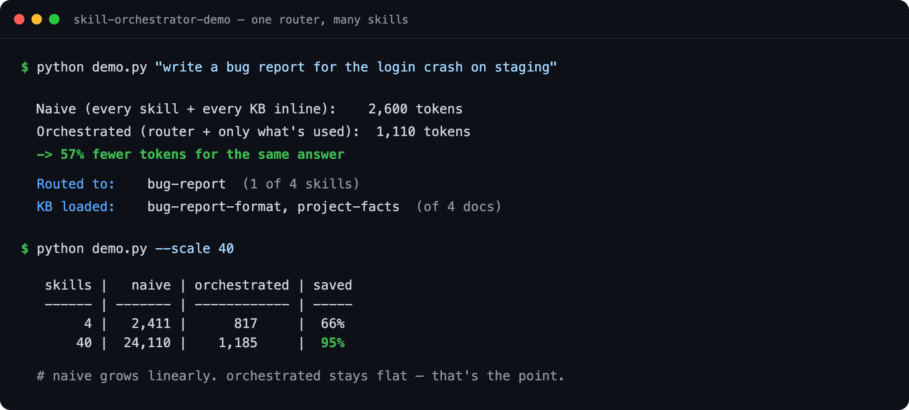

# skill-orchestrator-demo

**A ~150-line demo of how to give an AI agent dozens of capabilities without
blowing up your token bill.**

The trick isn't a bigger prompt — it's treating capabilities like software:
small **skills**, a **router** that loads only the ones a request needs, and a
shared **knowledge base** that skills *reference* instead of inlining.

Example domain: an AI agent for **QA / SDET** work — it can generate test cases,
file bug reports, triage flaky tests, and write release notes.



```
$ python demo.py "write a bug report for the login crash on staging"

  Naive (every skill + every KB inline):    2,600 tokens
  Orchestrated (router + only what's used):  1,110 tokens
  -> 57% fewer tokens for the same answer

  Routed to:    bug-report  (1 of 4 skills)
  KB loaded:    bug-report-format, project-facts  (of 4 total docs)
```

See it run:



## Why this matters

The naive way to add a capability is to paste more instructions into one giant
prompt. That cost grows **linearly** with every capability you add — and the
model gets *worse*, because the signal for this request drowns in context for
every other request.

The orchestrated way: per-request cost stays **roughly flat** no matter how many
skills you register.

```
$ python demo.py --scale 40

   skills |      naive | orchestrated | saved
  ------- | ---------- | ------------ | -----
        4 |      2,411 |          817 | 66%
       10 |      6,028 |          879 | 85%
       40 |     24,110 |        1,185 | 95%
```

## The architecture (progressive disclosure)

It's an operating system for capabilities: the router is the scheduler, skills
are the apps, the KB is the filesystem, and context is loaded lazily.

```
                    user request
                         │
                         ▼
                 ┌───────────────┐     Tier 1: ALWAYS loaded
                 │   ORCHESTRATOR │◀──  skill names + descriptions
                 │    (router)    │     (a few tokens each)
                 └───────┬───────┘
                         │ picks the right skill
          ┌──────────────┼──────────────┬──────────────┐
          ▼              ▼              ▼              ▼
     ┌─────────┐   ┌─────────┐   ┌─────────┐   ┌─────────┐
     │ test-   │   │  bug-   │   │ flaky-  │   │release- │   Tier 2: loaded
     │ cases   │   │ report  │   │ triage  │   │ notes   │   only when matched
     └────┬────┘   └────┬────┘   └────┬────┘   └────┬────┘
          └─────────────┴──── reads ──┴─────────────┘
                         │
                         ▼
              ┌──────────────────────┐   Tier 3: loaded only when the
              │   KNOWLEDGE BASE       │   matched skill references it
              │  conventions · facts   │
              │  bug-format · release  │
              └──────────────────────┘
```

1. **Tier 1 — index (always):** the agent always sees skill *titles + one-line
   descriptions*. Cheap. This is all it needs to route.
2. **Tier 2 — skill body (on match):** the chosen skill's full instructions load
   only when the router picks it.
3. **Tier 3 — KB (on demand):** a skill pulls only the KB docs it declares in
   `reads:` — not the whole knowledge base.

## Run it

```bash
python demo.py "generate test cases for the checkout flow"
python demo.py "this test keeps failing intermittently in CI"
python demo.py "draft release notes for v4.8.0"
python demo.py --scale 40        # project the cost curve

# Optional: exact, tokenizer-accurate counts (otherwise a close estimate is used)
pip install -r requirements.txt
```

## Layout

```
orchestrator.py   # the router + the 3-tier loading logic
demo.py           # naive vs orchestrated token accounting
token_utils.py    # tiktoken with a zero-dependency fallback
skills/<name>/SKILL.md   # one skill = one job (frontmatter declares routing + reads)
kb/<doc>.md              # shared knowledge skills reference, not inline
```

## Add a skill (the whole point — it's cheap)

Create `skills/my-skill/SKILL.md`:

```markdown
---
name: my-skill
description: One line the router uses to decide if this skill is relevant.
when_to_use: When the user asks to ...
keywords: [trigger, words, here]
reads: [some-kb-doc]
---

# My Skill
Instructions for the model when this skill is active.
```

That's it. The router picks it up automatically, and your per-request token cost
barely moves — that's the property the `--scale` projection demonstrates.

## Honesty notes

- Token counts use `tiktoken` (`cl100k_base`) when installed, else a ~4-chars/token
  estimate — the script prints which one it used.
- `route()` uses keyword scoring to stay offline and dependency-free. In a real
  system you'd replace it with a single LLM classification call over the (cheap)
  Tier-1 index — same architecture, smarter matching.
- The `--scale` table is a *projection* holding average skill/KB size constant,
  not a measurement of 40 real skills.
```
